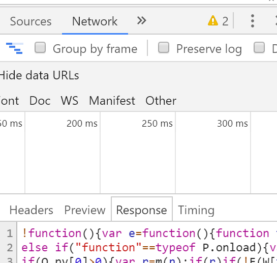
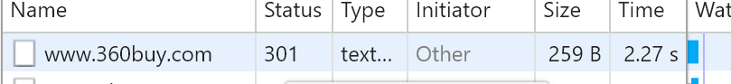

##AJAX
###ajax
`Async Javascript And XML 异步的js和XML`
```
作用:
通过AJAX技术,客户端就可以向服务器发送请求,把数据获取到客户端,或者是客户端将一些数据(比如表单提交)发送给服务器
```
###ajax异步的概念
```
此处的异步和我们之前所说的异步不太一样,这个指的是局部刷新
```
`局部刷新`
```
当我们打开一个页面,也就是在URL地址栏中输入一个网址,这样的请求是请求整个页面在客户端进行渲染,这个是整个个]页面的请求也就是全局刷新,除此之外,页面上也会需要有一部分数据需要去请求,但是这一部分数据不需要整个页面的刷新,只需要部分内容重新加载,这个叫做局部刷新,我们使用的ajax的请求方式
```
`XML`
```
html:超文本标记语言,W3C规定的
xhtml:更加严谨的html
dhtml:页面的部分数据是动态更新的
xml:可扩展的标记语言,在html的基础上自定义的标签
作用:
xml不用做展示,而在于存储,在很久以前,使用AJAX来进行数据交互时候通过XML格式的数据来交互的,后来发现数据解析起来不方便,就换成使用JSON
数据传输的格式:
json
xml
文件流:(buffer,二进制,base64...)
```
`xml`
```
<box>
    <student>
        <name>金雨生</name>
        <age>18</age>
        <score>81</score>
    </student>
    <student>
        <name>张增进</name>
        <age>20</age>
        <score>99</score>
    </student>
</box>
```
###ajax的基础用法
```
//1.创建一个ajax的异步的对象
let xhr=new XMLHTTPRequest();
//2.打开一个url地址并发请求(配置ajax请求的一些参数)
xhr.open([method],[url],[sync/async],[User.anme],[user.passWord]);
//3.监听请求的进程,获取数据
xhr.onreadystatechange=function(){
   xhr.readyState==4; ajax的状态码
   xhr.status==200;HTTP的状态码
   xhr.responseText;获取服务器返回值字符串格式
   xhr.responseXML;获取服务器返回值xml格式的
   ...
}
//4.向服务器发送数据
xhr.send();
```

####open
```
open("get","data/dada.json");
第三个参数默认是true(异步async);false(同步sync)
最后俩参数:用户名和密码
我们一般不设置,只有当服务器有安全限制的时候,限定某些用户是可以访问这个服务器的,这个时候访问时候就需要传入用户和密码
第一个参数:请求方式
[GET]:get,delete,head
[POST]:post,put
第二个参数:请求的URL地址
一般开发的时候都需要一个API文档,url你就直接看文档
```
####readystatechange
```
readystatechange:只要是ajax状态发生改变就会触发这个事件
xhr.readyState :  0,1,2,3,4
0:unSend未发送,创建一个ajax实例默认状态就是0
1:opened已打开,执行xhr.open()之后状态就是1
2:headers获取头部信息,客户端已经获取响应头信息
3:loading:服务器返回的响应主体在路上(在传输中)
4:done客户端已经接受到服务器返回的响应主体
```
`响应头和响应主体`
```
服务器和客户端交互的时候,肯定会将一些内容信息返回给客户端,返回的方式分为两种,就是响应头和响应主体
获取响应头
xhr.getResponseHeader("属性")
xhr.getAllResponseHeaders();
响应主体:
可以在控制台的network的response中查看
```


`请求头和请求主体`
```
客户端向服务器发送请求也可以向服务器发送数据,方式也是多种
- 通过设置请求头
- 请求主体
- 通过URL拼接查询参数的方式
xhr.setRequestHeader设置请求头信息
```
####xhr.timeout
```
xhr.timeout设置请求的超时时间,如果超过当前设置的时间还没有得到响应就算请求失败
同时也会触发xhr.ontimeout事件
```
####请求方式
```
1.GET系列:get,delete,head
一般都是从服务器上获取大量数据,例如获取一些信息显示在页面上
delete:删除,从服务器删除某些资源
head:只想从夫服务器上获取响应头(获取不到响应主体)
2.POST系列:post,put
一般都是客户端向服务器端发送时大量数据,比例表单提交,登录注册
put:存放,把一些资源存放到服务器上

```
`GET和POST的区别`
```
- 传参数的方式
get请求参数是放在URL上通过?参数=值&参数=值
xhr.open("get","/getUser?name=zf")
post:放在请求主体中
xhr.send('name=zf')
- 参数大小限制
get因为参数放在url,因为浏览器对url地址有大小限制,谷歌浏览器不能超过8KB,火狐是7KB,IE是2kb,超出部分会自动截取掉
post请求,数据放在请求主体中,请求主体没有大小限制,虽然没有限制但是真实项目中一般还是限制一下为了请求速度,比较大的会分次发送请求
- 安全性
get请求数据都展示在url上了,都被看光了不安全
一般考虑到安全性问题就使用POST就可以了
- 缓存
get方式是url问号传参很容易走缓存
一般都是在url后面拼接一个时间戳来防止缓存
POST请求不会走缓存
```
####HTTP网络状态码
```
200:成功OK一切正常
301:永久重定向
302:临时转移/重定向 服务器的负载均衡
307:临时重定向
304:读取缓存的内容
400:请求参数错误
401:权限不够
404:地址不存在
500:未知的服务器错误
503:服务器崩了,超负荷了

```


####真实项目的开发流程
设计岗位
1.产品:将一个想法变成现实可执行的需求,主要工作:需求分析,写需求文档,做产品的原型图(墨刀,AXURE)

2.UI设计:拿到产品的原型图和需求开始设计,讨论经过一番磨难最终设计出一版大家都比较满意的设计稿,又可能给你切图标注尺寸
3.开发人员
网站开发HTML+CSS:将设计稿变成网页
前端开发 :妹子
后台开发:
这俩波人开会讨论接口文案等
4.测试
开发完成后开始测试
5.运维
部署服务器上线
6.运营 产品推广


