##移动端开发预备篇


###一.H5新特性
####1.H5新标签
header、footer、nav、section、main、article、aside、figure、figcaption、hgroup、progress、time、mark(高亮选中)、datalist、details、summary…-->
```
<header>头部</header>
<nav>导航</nav>
<footer>底部</footer>
<section>区域<section/>
<main>主体部分<main/>
<article>文章<article/>
<aside>侧边栏,广告位<aside/>
<figure>
   
   <figcaption>配图说明<figcaption/>
<figure/>
<hgroup>一组标题<hgroup/>
<progress max="100" value="50"><progress/>滚动条
<time>时间<time/>
<mark>高亮选中<mark/>
<input list="dataList"/>
<datalist id="dataList">
   <option value='珠峰js'>珠峰js<option/>
   <option value='珠峰vue'>珠峰vue<option/>
   <option value='珠峰node'>珠峰node<option/>
<datalist/>
<details>
   <summary>珠峰前端课程<summary/>
   <ul>
      <li>HTML+CSS<li/>
      <li>JS<li/>
      <li>VUE+React+NODE<li/>
   <ul/>
<details/>
<></>
```
####2.表单元素的新属性
```
1.autocomplete: 自动完成填充,会记录之前输入的内容,给你自动提示
2.autofocus 打开页面自动获取鼠标的焦点
3.form='form的id':一个form之外的表单元素也让其属于这个form
4.width height :只存在域input 的type是image的表单元素
5.multiple:可以选择多个文件 
    <input type="file" multiple>
6.required:必填的
7.input的新type值
文字:
    <input type="text"> <br>
网址:
    <input type="url"> <br>
邮箱:
    <input type="email"> <br>
密码:
    <input type="password"> <br>
数字:
    <input type="number" max="10" min="0" step="3"/><br>
色卡:
    <input type="color">  <br>
电话:
    <input type="tel"> <br>
日期:
    <input type="date"><br>
日期:
    <input type="time"><br>
日期:
    <input type="datetime-local"><br>
日期:
    <input type="month"><br>
日期:
    <input type="week"><br>
范围:
    <input type="range"><br>
重置:
    <input type="reset"><br>
提交:
    <input type="submit">
pattern="":正则进行校验
novalidate:不做校验
```
####3.音频视频的处理
音频视频的常用属性和方法
```
<video src="movie.ogg" controls="controls">
如果浏览器不支持 video 标签。就会显示这里面的内容
</video>
*下是属性和方法*
    play()      播放视频音频
    pause()     暂停播放
    autoplay	设置或返回是否在加载完成后随即播放音频/视频
    controller	返回表示音频/视频当前媒体控制器的 MediaController 对象
    controls	设置或返回音频/视频是否显示控件（比如播放/暂停等）
    currentSrc	返回当前音频/视频的 URL
    currentTime	设置或返回音频/视频中的当前播放位置（以秒计）
    defaultMuted设置或返回音频/视频默认是否静音
    defaultPlaybackRate	设置或返回音频/视频的默认播放速度
    duration	返回当前音频/视频的长度（以秒计）
    ended	    返回音频/视频的播放是否已结束
    loop	    设置或返回音频/视频是否应在结束时重新播放
    muted	    设置或返回音频/视频是否静音
    paused	    设置或返回音频/视频是否静音是否暂停
    playbackRate设置或返回音频/视频播放的速度
    played	    返回表示音频/视频已播放部分的 TimeRanges 对象
    preload	    设置或返回音频/视频是否应该在页面加载后进行加载
    readyState	返回音频/视频当前的就绪状态
    seekable	返回表示音频/视频可寻址部分的 TimeRanges 对象
    seeking	    返回用户是否正在音频/视频中进行查找
    src	        设置或返回音频/视频元素的当前来源
    startDate	返回表示当前时间偏移的 Date 对象
    volume	    设置或返回音频/视频的音量
```
####4.H5本地存储
- localStorage
	
	localStorage,只要使用浏览器打开,存在里面的内容会被永久存储,关闭页面再打开任然存在,在其他的网页也可以获取
    localStorage.zf="珠峰培训";
    alert(localStorage.zf);
    localStorage.setItem("QQ","1144709265");
    localStorage.removeItem("QQ"); 
    //实现一个查看当前浏览次数的方法  
    if(!localStorage.getItem("n")){
        localStorage.setItem("n",1)
    }else {localStorage.setItem("n",parseInt(localStorage.getItem("n"))+1)
    }
    alert("这是第"+localStorage.getItem("n")+"次")

- sessionStorage

          //sessionStorage:存储在浏览器上,只要浏览器不关闭,就会有,关闭浏览器就是消失,但是在其他的页面中获取不到
    if(!sessionStorage.getItem("code")){
        sessionStorage.setItem("code",1)
    }else {
        sessionStorage.setItem("code",parseInt(sessionStorage.getItem("code"))+1)
    }
 
####5.案例
`H5表单验证`
###二.CSS3
####1.CSS3选择器
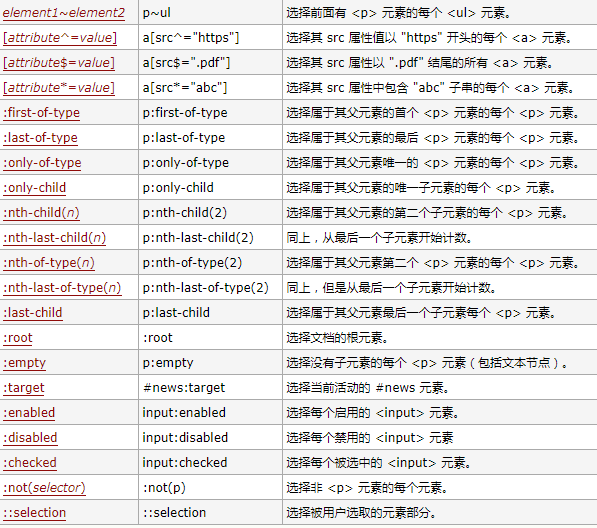
####2.border边框类
#####box-shadow
```
box-shadow(x y a b c i)
		x:水平方向的偏移 正：右边 ，负：左边
		y:垂直反方的偏移 正：下，    负：上
		a:模糊半径
		b:延伸半径
		c:颜色
		i:inset 设置内阴影
box-shadow: 1px 1px 1px rgba(0,0,0,.5),2px 2px 1px rgba(0,0,0,.3),3px 3px 1px rgba(0,0,0,.2),4px 4px 1px rgba(0,0,0,.1),5px 5px 1px rgba(0,0,0,.2),6px 6px 1px rgba(0,0,0,.3),7px 7px 5px rgba(0,0,0,.4) ;
```
效果
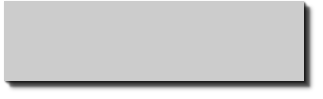

#####border-radius
```
width: 200px;
height: 200px;
border:5px solid #000;
border-top-right-radius: 100px 50px ;右上角
```
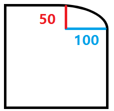

#####border-image
```
border: 27px solid orange;
border-image: url() 展示方式 剪切方式;
展示方式 1.stretch  拉伸 默认值
		2.round 平铺
		3.repeat 复制
剪切方式: 1 2 3 4		
```
对应下面的剪切方式
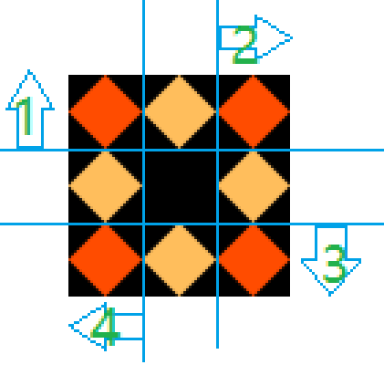
案例
```
width: 100px;
height: 100px;
border: 27px solid orange;
border-image: url(../img/border.png)stretch repeat 27;
只写一个代表四个值都一样
```
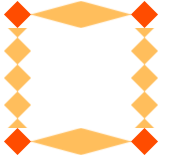

####3.background背景类
#####background-origin
`
 不会改变图片大小，顾上不顾下，顾左不顾右，只要不超出border就可以
`
```
background-origin: border-box;
/*从border的外边界算起，也就是包括border*/
background-origin: padding-box;
/*包括padding，不包括border*/
background-origin:content-box
/*只有内容部分不包括padding*/
```
#####background-clip
`
跟background-origin的区别:超出的部分会剪裁掉
`
```
background-clip: border-box;
background-clip: padding-box;
background-clip: content-box;
```
#####background-size
```
background-size: auto;
background-size: 100% 100%;
background-size: cover;
/*cover:放大图片以适应铺满整个容器，但是宽高比例不变，让图片失真*/
ackground-size: contain;
/*contain 将图片缩小，能在盒子中展示，原来宽高比例不变，也是会让图片失真*/
```
#####多张背景图片
`/*既然背景图片可是复制，也就是说背景图片可以放多张*/`
`案例制作相框`
```
.box{
	width: 240px;
	font-size: 25px;
	line-height: 50px;
	text-align: center;
	border:20px solid rgba(104,104,142,0.5) ;
	padding: 60px 40px;
	border-radius: 10px;
	color: #f36;
	margin: 40px auto;
	background: url(../img/bg-tl.png)no-repeat top left,
		url(../img/bg-tr.png)no-repeat top right,
		url(../img/bg-br.png)no-repeat bottom right,
		url(../img/bg-bl.png)no-repeat bottom left,
		url(../img/bg-repeat.png) repeat left top;
	background-origin: border-box, border-box ,padding-box ,padding-box ,padding-box;  
	}
```


####4.渐变类
#####线性渐变
```
下面的四中写法是一样的
background: linear-gradient(red,yellow,green,blue);
background: linear-gradient(top red,yellow,green,blue);
background: linear-gradient(to bottom red,yellow,green,blue);
background: linear-gradient(270deg  red,yellow,green,blue);
```
`
可以在每个颜色后面加百分比
background: linear-gradient(red 50%,green 50%);
效果如下
`
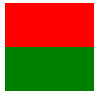

#####径向渐变
```
background: radial-gradient(#fff,yellow,orange,red,plum);
注意:* 0，0 盒子的左上角
/*圆心的位置：50px 200px*/
background: radial-gradient(50px 200px,#fff,yellow,orange,red,plum);
/*circle强制圆形渐变*/
background: radial-gradient(circle,#fff,yellow,orange,red,plum);
/*长方形 ：默认值ellipse椭圆形渐变*/
background: radial-gradient(ellipse,#fff,yellow,orange,red,plum);
/*渐变的圆心位置是0,200,半径是200*200的圆*/
background: radial-gradient(200px  200px at 0px 200px,#fff,yellow,orange,red,plum);
还有例如:200px  200px at top
       200px  200px at 0 50%
       circle at 0 50%
扩展知识:自己查
1.losest-side /  farthest-side
2.closest-corner / farthest-curner
3.background: -repeating-radial-gradient(#ddd,#ddd 5px,yellow 10px,orange 15px);
3的效果如下
```
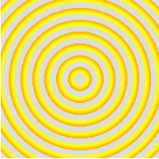

####5.文本类
#####制作字体图标
`自己查看我们的课件关于如何制作字体图标`
#####text-shadow
```
text-shadow:x,y,a,b,c
    x:水平方向的偏移 正：右边 ，负：左边
	y:垂直反方的偏移 正：下，    负：上
	a:模糊半径
	b:延伸半径
	c:颜色
text-shadow: 0 0 0 rgb(188,178,188),1px -1px 0 rgb(173,163,173),2px -2px 0 rgb(157,147,157),3px -3px 0 rgb(142,132,142),4px -4px 0 rgb(126,116,126),5px -5px 0 rgb(111,101,111), 6px -6px 0px rgb(95,85,95),7px -7px 0 rgb(79,69,79),8px -8px 7px rgba(0,0,0,.2);
```
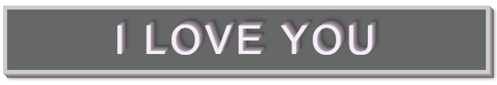
#####text-overflow:clip/ellipsis
		clip:对于文本内容超出容器会被裁剪，但是不会显示省略号
		ellipsis：超出内容裁剪，显示省略号 必须配合使用overflow:hidden，white-space:nowarp,才有效果			
#####word-wrap:normal/break-word	
		normal:默认值，控制连续文本换行（允许内容撑破容器边界,英文单词不断开）
		break-word:在容器边界换行（截断英文单词）		
#####word-break：normal/break-all/keep-all
		normal 默认值 中文会换行，英文不会
		break-all:可以强制截断英文换行
		keep-all:不允许断开 中文会把标点符号前后的一个词或者短语整个换行 英文加上-会折行		
		
####6.滤镜
```
li:nth-child(1){
	/*grayscale灰度*/
	filter: grayscale(1);
}
li:nth-child(2){
	/*sepia:褐色*/
	filter: sepia(1);
}
li:nth-child(3){
	/*saturate() 饱和度*/
	filter: saturate(500%);
}
li:nth-child(4){
	/*hue-rotate() 色相反转*/
	filter: hue-rotate(180deg);
}
li:nth-child(5){
	/*invert(1):反色*/
	filter: invert(1);
}
li:nth-child(6){
	/*opacity() 透明度*/
	filter: opacity(.3);
}
li:nth-child(7){
	/*brightness(200%)亮度*/
	filter: brightness(250%);
}
li:nth-child(8){
	/*contrast(200%) 对比度*/
	filter: contrast(200%) drop-shadow(2px 3px 5px rgba(0,0,0,.5));
}
li:nth-child(9){
	/*blur(2px) 模糊度*/
	filter: blur(2px);
}
li:nth-child(10){
	/*drop-shadow(2px 3px 5px rgba(0,0,0,.5))阴影*/
	filter: drop-shadow(2px 3px 5px rgba(0,0,0,.5));
}
```
效果分别是
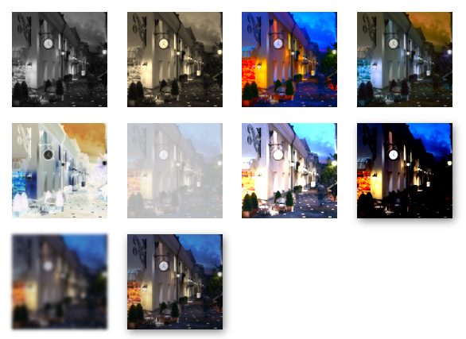

####7.transform变形
#####1.2D
```
每一次移动坐标改变了；
坐标是根据元素来画的，每个元素都有自己各自的坐标，各自之间没有关系，现有元素才会有坐标
translate(X,Y)
	X:向X轴方向平移 正：右边，负：左边
	Y:向Y轴方向平移 正：下边，负：上边
	translate(X)====translateX(X) 
	如果你只传了一个值就代表 向X轴方向平移
		translateX(X)
		translateY(Y)		
缩小放大表示的是轴缩小放大
	scale(n)整体放缩， n:(0-1)缩小  ，n>1放大，n=1不变
	scaleX(nX)x轴方向缩小、放大
	scaleY(nY)x轴方向缩小、放大		
rotate(20deg)绕着中心（元素中心）旋转20度  正：顺时针  负：逆时针
skew(Xdeg,Ydeg)只穿了一个就相当于skewX(Xdeg);
	skewX(Xdeg)
	skewY(Ydeg)
旋转中心:transform-origin: 50% 50%		
```
`例如transform: skewX(30deg);的效果就是`
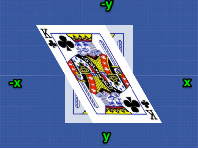

#####2.3D
```

视距perspective：模拟眼睛到元素的距离，一般都是给较高级，父级的父级
视觉中心:perspective-origin
3D属性 transform-style：preserve-3d告诉浏览器这里面呈现出来的是3D效果 一般都是给父级加
	平移：translateX，translateY，translateZ（正：前，负；后），
	旋转：rotateX，rotateY，rotateZ  注意：从轴的正方向看
		rotate3d(1,2,0)
		1+(1-cos(a)(x^2-1))     z*sin(a)+xy(1-cos(a))  -y*sin(a)+yz(1-cos(a))
		-z*sin(a)+xy(1-cos(a))  1+(1-cos(a))(y^2-1)    s*sin(a)+yz(1-cos(a))
		y*sin(a)+xy(1-cos(a))   -x*sin(a)+yz(1-cos(a)) 1+(1-cos(a)(z^2-1))
	缩放:scale		
	    scaleX()
	    scaleY()
	    scaleZ()

```
`改变视距和视觉中心的效果`
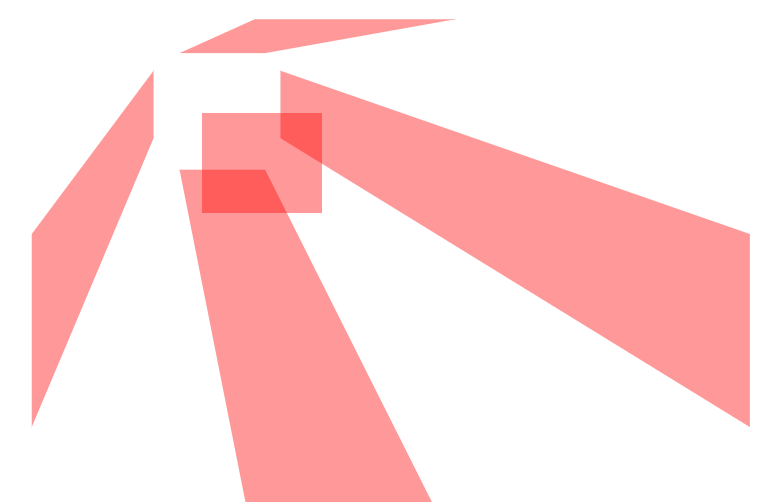

####8.transition过渡
```
transition：left 2s 1s ease-out
		参数1：一个具体的属性left/或者all，
		参数2：运动时间
		参数3：延迟时间
		参数4：运动曲线
		ease:默认值 渐渐变慢
		linear：匀速直线运动
		ease-in:由慢变快
		ease-out：由快变慢
		ease-in-out：由慢变快再变慢
参数也可以分开写
transition-property
transition-duration
transition-timing-function
transition-delay		
```
####9.animation 动画
```
animation:自定义动画名字（必填） ， 运动总时间（必填），延迟时间，执行的次数（默认是一次 ，infinite：无数次），运动曲线（ease默认），both(停在最后一帧);
参数分开
animation-name
animation-duartion
animation-timing-function
animation-delay
animation-iteration-count
animation-direction
animation-play-state
animation-fill-mode
```
可以写一个旋转的魔方
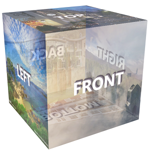
#####案例
```
1.3D旋转魔方
2.背景图片切换
3.3D信息展示
```
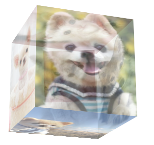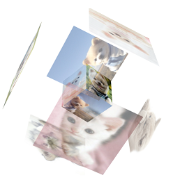

####10.animate.css 帧动画库
`自己学会使用这个动画库`
####11.css3 steps精灵动画
####12.canvas动画
`我们有课件,抽时间给大家讲一下基本用法,或者我录制一套视频`